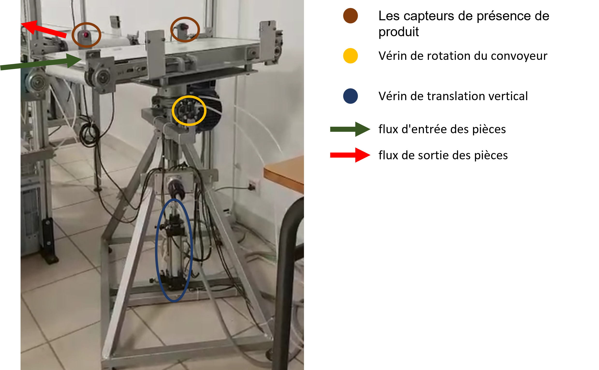
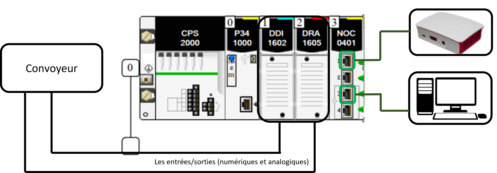
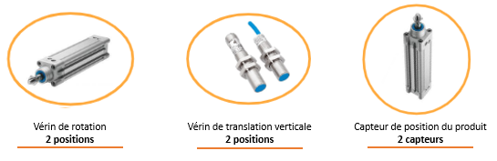
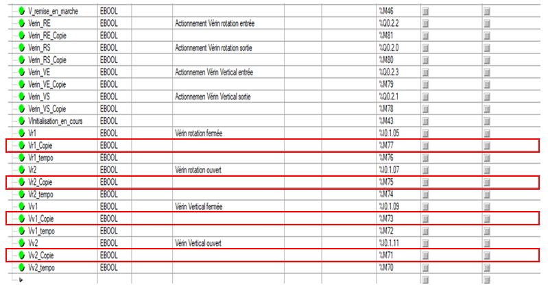
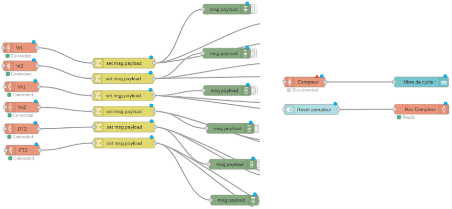
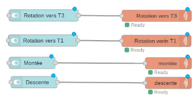
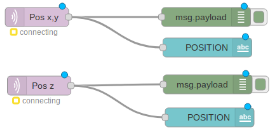
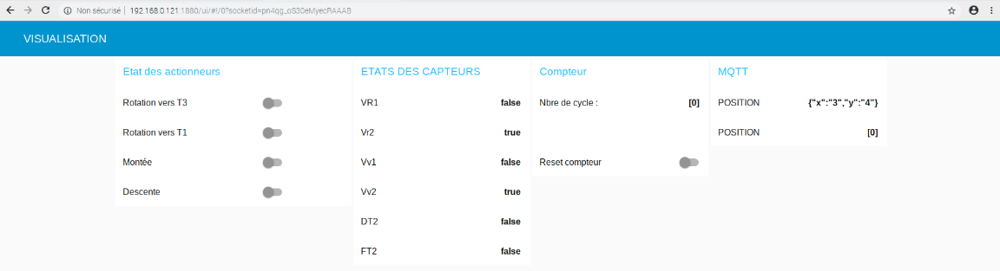

# Utilisation de Modbus TCP pour la lecture et l'écriture de donnes sur M340-ATV

Bienvenue sur mon projet ! Ce projet utilise la technologie de communication Modbus TCP pour établir une connexion entre une application et un automate M340-ATV, permettant ainsi la lecture et l'écriture de données sur cet automate.  
Dans ce fichier README, vous trouverez des informations détaillées sur la mise en place de cette connexion ainsi que les instructions pour utiliser notre application. J'espère que ce projet vous sera utile et n'hésitez pas à me contacter si vous avez des questions ou des commentaires.  

**La version anglaise de ce README se trouve** [ici](https://github.com/MehdiAllani/Utilisation-de-Modbus-TCP-pour-la-lecture-et-l-ecriture-de-donnes-sur-M340-ATV/blob/main/ReadmeAng.md#use-of-modbus-tcp-for-reading-and-writing-data-on-m340-atv).

---
Table des matières
1. [Mise en situation](https://github.com/MehdiAllani/Utilisation-de-Modbus-TCP-pour-la-lecture-et-l-ecriture-de-donnes-sur-M340-ATV#1-mise-en-situation)
2. [L'objectif du projet](https://github.com/MehdiAllani/Utilisation-de-Modbus-TCP-pour-la-lecture-et-l-ecriture-de-donnes-sur-M340-ATV#2-lobjectif-du-projet-) 
3. [Présentation du convoyeur et de son fonctionnement en mode automatique](https://github.com/MehdiAllani/Utilisation-de-Modbus-TCP-pour-la-lecture-et-l-ecriture-de-donnes-sur-M340-ATV#3-pr%C3%A9sentation-du-convoyeur-et-de-son-fonctionnement-en-mode-automatique-)
4. [Solution proposée: (domaine industrie 4.0)](https://github.com/MehdiAllani/Utilisation-de-Modbus-TCP-pour-la-lecture-et-l-ecriture-de-donnes-sur-M340-ATV#4-solution-propos%C3%A9e-domaine-industrie-40)
5. [Problematique](https://github.com/MehdiAllani/Utilisation-de-Modbus-TCP-pour-la-lecture-et-l-ecriture-de-donnes-sur-M340-ATV#5-problematique-) 
6. [Réalisation](https://github.com/MehdiAllani/Utilisation-de-Modbus-TCP-pour-la-lecture-et-l-ecriture-de-donnes-sur-M340-ATV#6-r%C3%A9alisation-)
	1. [Matériels](https://github.com/MehdiAllani/Utilisation-de-Modbus-TCP-pour-la-lecture-et-l-ecriture-de-donnes-sur-M340-ATV#i-mat%C3%A9riels-)
	2. [Définition du protocole de communication](https://github.com/MehdiAllani/Utilisation-de-Modbus-TCP-pour-la-lecture-et-l-ecriture-de-donnes-sur-M340-ATV#ii-d%C3%A9finition-du-protocole-de-communication-) 
	3. [Connexions des trois appareils à un même réseau Modbus TCP](https://github.com/MehdiAllani/Utilisation-de-Modbus-TCP-pour-la-lecture-et-l-ecriture-de-donnes-sur-M340-ATV#iii-connexions-des-trois-appareils-%C3%A0-un-m%C3%AAme-r%C3%A9seau-modbus-tcp-) 
	4. [Programme Node-RED](https://github.com/MehdiAllani/Utilisation-de-Modbus-TCP-pour-la-lecture-et-l-ecriture-de-donnes-sur-M340-ATV#iv-programme-node-red-)
		1. [Lecture des données des capteurs](https://github.com/MehdiAllani/Utilisation-de-Modbus-TCP-pour-la-lecture-et-l-ecriture-de-donnes-sur-M340-ATV#a-lecture-des-donn%C3%A9es-des-capteurs-) 
		2. [Écriture ou commande à travers notre interface](https://github.com/MehdiAllani/Utilisation-de-Modbus-TCP-pour-la-lecture-et-l-ecriture-de-donnes-sur-M340-ATV#b-%C3%A9criture-ou-commande-%C3%A0-travers-notre-interface-)
		3. [Échange de données](https://github.com/MehdiAllani/Utilisation-de-Modbus-TCP-pour-la-lecture-et-l-ecriture-de-donnes-sur-M340-ATV#c-%C3%A9change-de-donn%C3%A9es-)
		4. [Visualisation à travers une interface Node-RED](https://github.com/MehdiAllani/Utilisation-de-Modbus-TCP-pour-la-lecture-et-l-ecriture-de-donnes-sur-M340-ATV#d-visualisation-%C3%A0-travers-une-interface-node-red-)
7. [Vidéo](https://github.com/MehdiAllani/Utilisation-de-Modbus-TCP-pour-la-lecture-et-l-ecriture-de-donnes-sur-M340-ATV#7vid%C3%A9o)
8. [Conclusion](https://github.com/MehdiAllani/Utilisation-de-Modbus-TCP-pour-la-lecture-et-l-ecriture-de-donnes-sur-M340-ATV#7-conclusion-)

---
### 1. Mise en situation:

 [L'école universitaire de physique et d'ingénierie](https://eupi.uca.fr/) dispose d'une ligne de production pédagogique, où un convoyeur rotatif (C) est utilisé pour transporter les pièces fournies par un convoyeur (T1) à un autre convoyeur (T2) perpendiculaire à T1.  Ce convoyeur rotatif est un élément clé de la ligne de production, car il permet de transporter les pièces d'une station à l'autre en utilisant des capteurs et des actionneurs pour optimiser le processus de production. Il est donc crucial de bien comprendre son fonctionnement et son utilisation pour garantir une efficacité maximale de la ligne de production.

 

### 2. L'objectif du projet : 

- Améliorer la connectivité, la surveillance et l'automatisation d'une machine industrielle existante.

### 3. Présentation du convoyeur et de son fonctionnement en mode automatique :
Ce convoyeur rotatif est équipé de différents capteurs, tels que des capteurs de position de vérins et de la pièce, ainsi que de plusieurs actionneurs, tels que des vérins et des moteurs. L'ensemble du système est contrôlé par un automate programmable industriel (API) M340, qui est responsable de l'exécution des différents processus de la machine.
```
1. Condition initiale (Convoyeur en face du convoyeur (T1)).
2. Condition (À la détection d'une pièce au début du convoyeur) : convoyeur monte.
3. Condition (Une fois arrivé au niveau haut) : rotation vers la direction du convoyeur (T2).
4. Condition (Rotation terminée) : convoyeur descend.
```

### 4. Solution proposée: (domaine industrie 4.0)

- En intégrant une carte Raspberry Pi dans cette machine, nous pouvons connecter les capteurs et les actionneurs de la machine à la carte. La carte peut alors lire les données des capteurs et les envoyer à un système de surveillance à distance.
- En utilisant Node-RED comme interface, nous pouvons créer une interface graphique conviviale pour surveiller les données des capteurs et les états des actionneurs.


### 5. Problematique :

1. Comment intégrer une carte Raspberry Pi dans une machine industrielle automatisée ?
2. Comment concevoir une interface Node-RED pour le contrôle en temps réel des actionneurs et l'automatisation des processus industriels ?

### 6. Réalisation :

### i. Matériels :
J'ai eu à ma disposition le convoyeur relié à un automate Schneider M340 équipé d'un module de communication Ethernet NOC 0401, d'une carte Raspberry Pi 3 B+ et d'un ordinateur de bureau.



### ii. Définition du protocole de communication :

La communication entre les dispositifs d'automatisation industrielle se fait avec le protocole Modbus, tandis qu'Ethernet est un protocole de communication pour les réseaux locaux.

Il existe une variante de Modbus appelée Modbus TCP qui permet une communication directe via Ethernet en encapsulant les données Modbus dans des paquets TCP/IP. 

La relation entre Modbus et Ethernet peut être établie via un convertisseur Modbus vers Ethernet ou directement via le **protocole Modbus TCP**.

### iii. Connexions des trois appareils à un même réseau Modbus TCP :
<pre>

Il existe 3 conditions à respecter :

> Les adresses IP des trois appareils doivent être dans le même réseau IP.
> Les adresses IP doivent être dans la plage d'adresses IP attribuée au réseau.
> Les adresses IP doivent être différentes l'une de l'autre (unique sur le réseau).

</pre>

Dans cet exemple,
```
- Nous avons défini le réseau IP comme étant "192.168.0.0".
- Nous avons attribué une plage d'adresses IP de "192.168.0.1" à "192.168.0.254".
```
Pour respecter ces conditions, nous pouvons attribuer les adresses IP suivantes à chaque appareil :
```
Automate : 192.168.0.1
Ordinateur fixe : 192.168.0.241
Carte Raspberry : 192.168.0.121
```
### iv. Programme Node-RED :

Pour la réalisation de notre projet, nous avons développé 4 fonctionnalités :

### a. Lecture des données des capteurs :

Je vais vous décrire la marche à suivre que j'ai adoptée.

- **Identification des capteurs et de leurs adresses :**
```
Pour la lecture, nous avons commencé par identifier les capteurs dans tout le système,  
nous avons trouvé 6 capteurs, donc 6 données à lire :
```



- **Création de copies des adresses des capteurs :**
```
Pour manipuler les variables d'états de nos capteurs, nous avons créé des copies sous forme de bits  
mémoire sur le programme de l'automate programmable industriel (API) M340, qui est responsable de  
l'exécution des différents processus de la machine.
```


- **Pour la collecte des données, nous avons utilisé 3 nœuds :**
```
Nœud client Modbus TCP : il suffit d'identifier le type de variable et son adresse.
Nœud Change : qui, dans ce cas, permet de prendre un bit d'une donnée de taille word.
Nœud debug : qui permet d'afficher les données transmises dans le flux.	
```


### b. Écriture ou commande à travers notre interface :
Pour l'envoi de commandes, nous avons utilisé 2 nœuds :

```
Nœud Switch : qui permet de contrôler l'action du convoyeur.
Nœud client Modbus TCP : pour écrire msg.payload.
```

### c. Échange de données :

Pour l'échange de données avec une autre machine industrielle disposant d'une autre carte Raspberry, nous avons ajouté des nœuds "mqtt out", qui permettent de publier des messages à un broker MQTT.


Pour tester la récupération des valeurs de nos capteurs, nous avons testé le partage d'informations sur 2 réseaux :

**1. Réseau wlan0 :**

Tous mes capteurs sont accessibles de n'importe quelle carte depuis 
```
Topic : tp4/Nom_du_capteur
Réseau : 192.168.50.171 (wlan0)
```
**2. Réseau local :**
```
Topic : tp4/Nom_du_capteur
Réseau : 127.0.0.1 (lo)
```
Nous avons également pu récupérer les positions x, y et z à travers :
```
Server : 192.168.50.83 (wlan0)
Topic : Pos x, y et Pos z
```


### d. Visualisation à travers une interface Node-RED :
Pour la visualisation, j'ai divisé mes données en groupe et utilisé :
```
Nœud Switch pour l'écriture.
Nœud Text pour l'affichage.
```


### 7.Vidéo

[Vidéo](https://youtu.be/ojUAjaii7UQ)

### 8. Conclusion :
Grâce à ce projet, j'ai pu acquérir les compétences suivantes :
- Créer un réseau Modbus TCP.
- Modifier l'adresse IP d'un Raspberry Pi ou d'un PC.
- Établir une communication en lecture.
- Établir une communication en écriture.
- Visualiser les échanges.
- Effectuer des échanges internes et externes.


## Auteur
* Créé par [Mehdi Allani](https://www.linkedin.com/in/mehdi-allani-3a18ab1b2/) le 08 avril 2023.